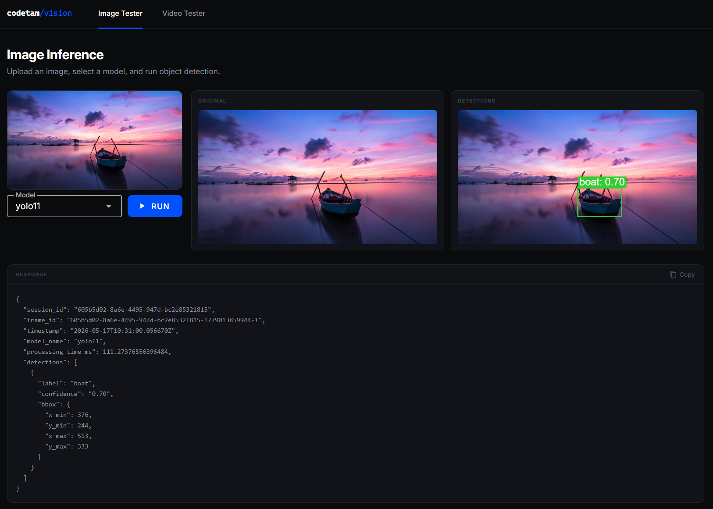
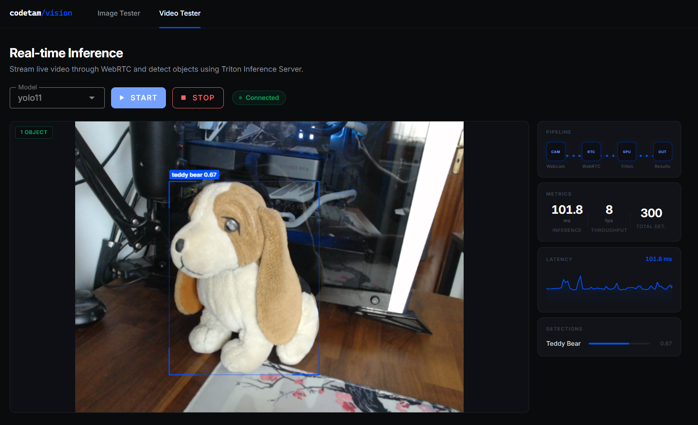

# codetam/vision

A production-grade, fully containerized platform for real-time computer vision inference. Upload a static image or stream live webcam video and get object detection results powered by NVIDIA Triton Inference Server, rendered directly in the browser with sub-100ms latency on a local GPU.

---

## Screenshots

### Image Inference



### Live Video Streaming



---

## How It Works

The system is split into three layers that communicate through Redis and WebRTC:

```
Browser ──HTTP──▶ FastAPI ──Redis Stream──▶ inference_worker ──gRPC──▶ Triton
   │                                                                      │
   │                                                             detections (Redis)
   │◀──────────────────── WebSocket ─────────────────────────────────────┘

Browser ──WebRTC──▶ rtc_worker ──gRPC──▶ Triton
   │                                       │
   │◀──── DataChannel (JSON detections) ───┘
```

### Image pipeline

1. The user uploads an image in the **Image Inference** tab and selects a model.
2. The browser opens a WebSocket to the FastAPI backend and POSTs the image.
3. FastAPI writes the job to a Redis stream; `inference_worker` picks it up and runs the model via Triton's gRPC API.
4. Detections are published back to Redis; FastAPI forwards them over the WebSocket.
5. The browser draws bounding boxes on the original image using the Canvas API.

### Video pipeline

1. The user opens the **Video Inference** tab and clicks **Start**.
2. The browser captures the webcam, creates an `RTCPeerConnection`, and performs a standard WebRTC offer/answer exchange through FastAPI (which relays the SDP to a Redis stream read by `rtc_worker`).
3. `rtc_worker` (powered by [aiortc](https://github.com/aiortc/aiortc)) receives the video track, samples frames at a configurable rate, and runs async gRPC inference against Triton.
4. Detection results are sent back through a WebRTC **DataChannel** as JSON.
5. The browser maps the raw video coordinates to the displayed canvas region and draws labelled bounding boxes in real time.

A TURN server (coturn) is included so the WebRTC connection works across NAT/firewalls without any extra setup.

---

## Stack

| Component | Technology |
|---|---|
| Frontend | Vue 3, Vuetify 3, TypeScript, Vite |
| API | FastAPI (Python 3.11) |
| Image inference worker | Python + asyncio, Redis streams |
| Video inference worker | Python + asyncio, aiortc |
| Inference server | NVIDIA Triton Inference Server |
| Model | YOLO11 (ONNX) |
| Message bus | Redis 7 |
| TURN relay | coturn 4.7 |
| Container runtime | Docker Compose |

---

## Prerequisites

- Docker and Docker Compose
- NVIDIA GPU with drivers installed
- [NVIDIA Container Toolkit](https://docs.nvidia.com/datacenter/cloud-native/container-toolkit/install-guide.html) (`nvidia-docker`)
- A YOLO11 model exported to ONNX and placed in the Triton model repository (see [Model setup](#model-setup))

---

## Model Setup

Triton expects a model repository under `models/` at the project root. The expected layout for YOLO11 is:

```
models/
└── yolo11/
    ├── config.pbtxt
    └── 1/
        └── model.onnx
```

A minimal `config.pbtxt`:

```
name: "yolo11"
platform: "onnxruntime_onnx"
max_batch_size: 0

input [
  { name: "images" data_type: TYPE_FP32 dims: [ 1, 3, 640, 640 ] }
]

output [
  { name: "output0" data_type: TYPE_FP32 dims: [ 1, 84, 8400 ] }
]
```

---

## Running Locally

### Development (hot-reload)

```bash
cd docker
docker compose -f docker-compose.yml -f docker-compose.override.yml up --build
```

| Service | URL |
|---|---|
| Frontend (Vite dev server) | http://localhost:3000 |
| FastAPI | http://localhost:8000 |
| Triton HTTP | http://localhost:8002 |

### Production

```bash
cd docker
docker compose up --build -d
```

The frontend is built and served by Nginx on port 80.

---

## Configuration

Key environment variables (set in `docker-compose.yml` or an `.env` file):

| Variable | Default | Description |
|---|---|---|
| `REDIS_URL` | `redis://redis:6379/0` | Redis connection string |
| `TRITON_GRPC_URL` | `triton:8001` | Triton gRPC endpoint used by workers |
| `TRITON_HTTP_URL` | `triton:8002` | Triton HTTP endpoint used by FastAPI |
| `INFERENCE_EVERY_N_FRAMES` | `3` | Frame sampling rate for video inference |

---

## Project Structure

```
.
├── backend/
│   ├── fastapi/          # REST + WebSocket API, WebRTC signaling relay
│   └── inference_worker/ # Image worker (inference_worker.py)
│                         # Video worker (rtc_receiver.py)
├── docker/               # Compose files
├── frontend/
│   └── app/              # Vue 3 + Vuetify SPA
└── models/               # Triton model repository (not committed)
```